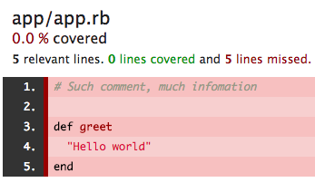
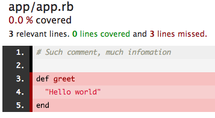

# Simplecov issue reproduction

Unloaded files have all lines classified as relevant, but whitespace / comments should not count towards code coverage.

This leads to the overall coverage being understated.

- Github issue: https://github.com/colszowka/simplecov/issues/604
- Contributed PR: https://github.com/colszowka/simplecov/pull/605

## Actual result:

Shows 5 relevant lines

## Expected result:

Shows 3 relevant lines
